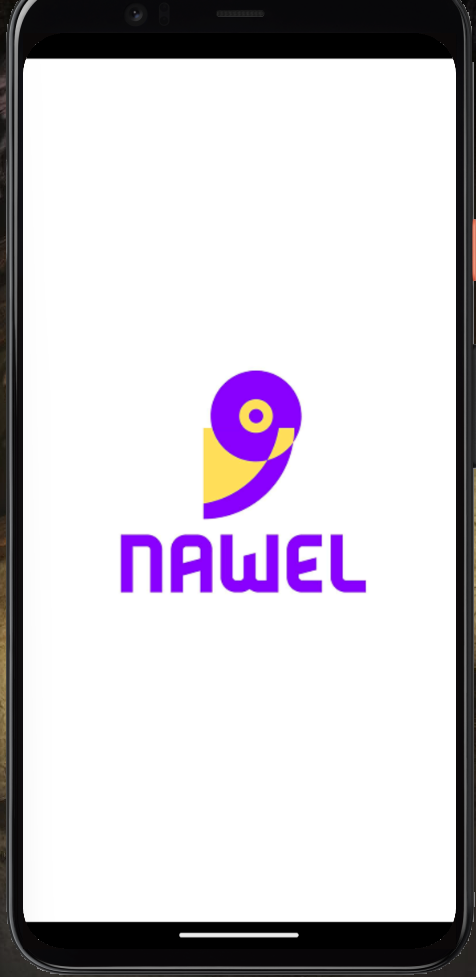
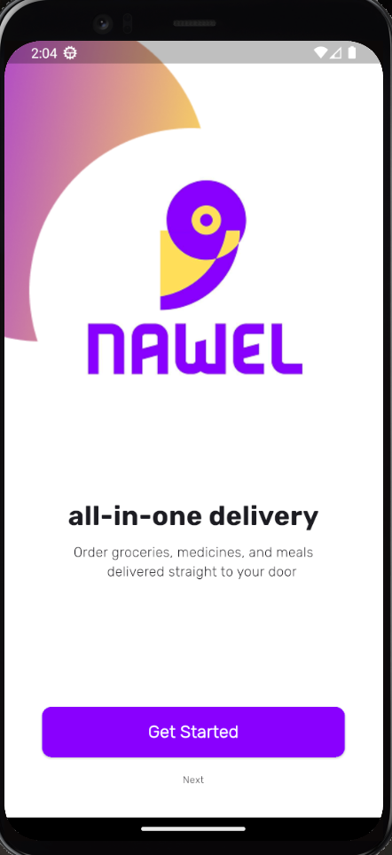
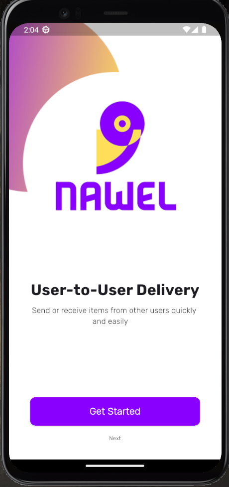
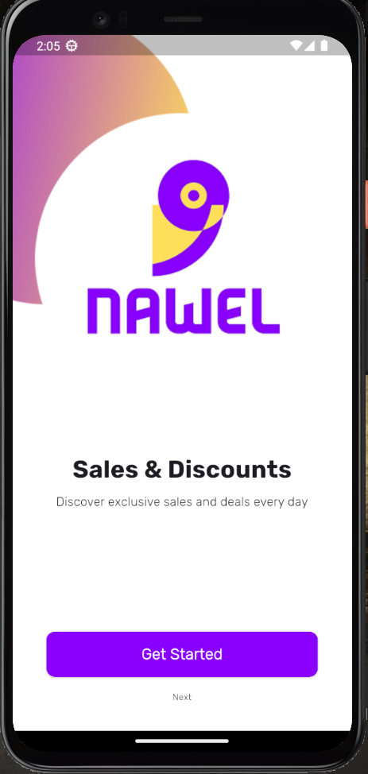
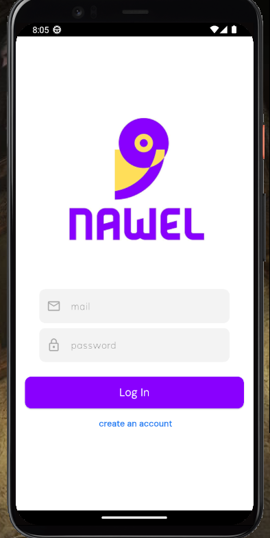
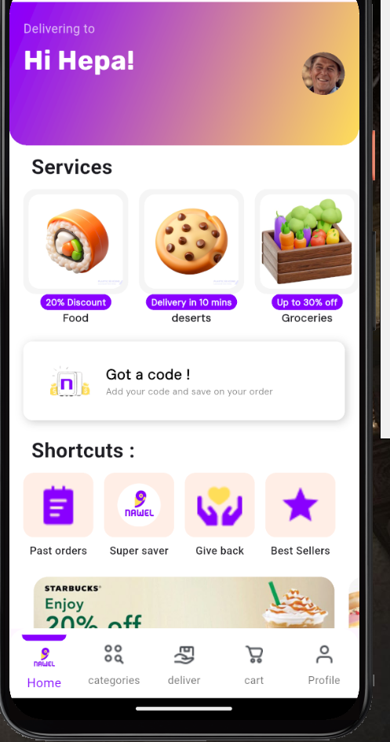
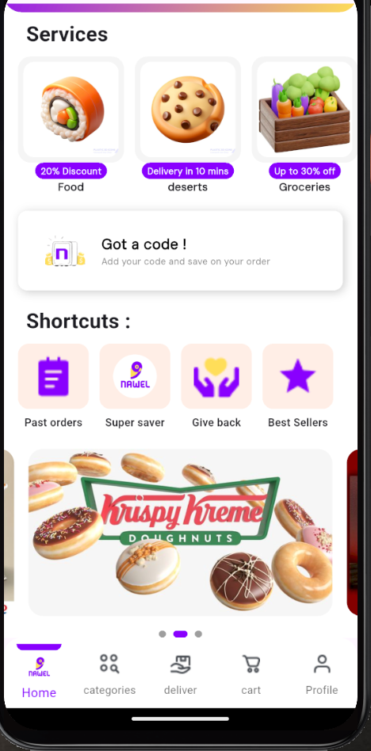

# 🛍️ Nawel E-Commerce App

A modern e-commerce mobile application built using **Flutter**, applying the **Clean Architecture** approach and using **BLoC** for state management.  
The app integrates **Firebase Authentication**, **Firestore**, and **Cloud Storage** to provide real-time data and user authentication.

---

## 📅 Last Updated
June 19, 2025

---

## 📱 Main Features

- 🔐 Firebase Authentication (Sign Up & Login with Email)
- 🧭 Onboarding with Bloc & PageView
- 🏠 Home screen includes:
  - Header with user name and image (from Firestore)
  - Main Services (fetched from Firestore)
  - Promo Code Card
  - Shortcut Section
  - Banner Carousel (auto scroll + page indicators)
- 🚀 Splash Screen with sliding animation
- 💡 Clean Architecture & Reusable Widgets

---

## 🧱 Clean Architecture Overview

```bash
lib/
├── core/
│   ├── di/               # Dependency injection (get_it)
│   ├── routing/          # App routes and navigation
│   └── utils/            # Shared utilities (colors, sizes...)
├── Features/
│   ├── auth/
│   │   ├── data/
│   │   ├── domain/
│   │   └── presentation/
│   ├── home/
│   │   ├── data/
│   │   ├── domain/
│   │   └── presentation/
│   └── onboarding/
│       ├── data/
│       └── presentation/
└── main.dart
```

---

## 🔧 Dependencies

```yaml
flutter_bloc: ^8.1.3
firebase_core: ^2.13.0
firebase_auth: ^4.6.2
cloud_firestore: ^4.8.3
get_it: ^7.6.0
dartz: ^0.10.1
equatable: ^2.0.5
```

---

## 🔄 State Management

Using `flutter_bloc` with **immutable state** and `copyWith()` for safe updates.

**Benefits:**
- Prevents unexpected side effects
- Ensures predictable UI behavior
- Makes Bloc testable and scalable

---

## 🧠 Auth Module

- SignUp and Login using Firebase Auth
- `AuthBloc` handles events: `SignUpEvent`, `LoginEvent`
- States: `AuthLoading`, `AuthSuccess`, `AuthFailure`
- UseCases: `LoginUseCase`, `RegisterUseCase`
- Dependency Injection via `GetIt`

---

## 🚀 Splash Screen

- Slide animation using `SlideTransition`
- Navigates to onboarding screen after animation
- Clean implementation with `AnimationController`

---

## 📖 Onboarding

- Multiple onboarding screens with PageView.builder
- Controlled by Bloc (`OnboardingBloc`) and PageController
- Pages stored as `OnboardingModel`
- Automatically navigates to login on last page

---

## 🖼️ Banner Carousel

- Fetches banners from Firestore
- Implements `PageView` with dot indicators
- Controlled by `BannerBloc` with immutable state
- Uses `copyWith` for state consistency

---

## 📦 Local Development

```bash
flutter pub get
flutter run
```

---

## 📸 Screenshots
🟡 Splash 


### 🟣 Onboarding Flow
  

---

### 🟡 Authentication

 


---

### 🟢 Home Screen
 


---

